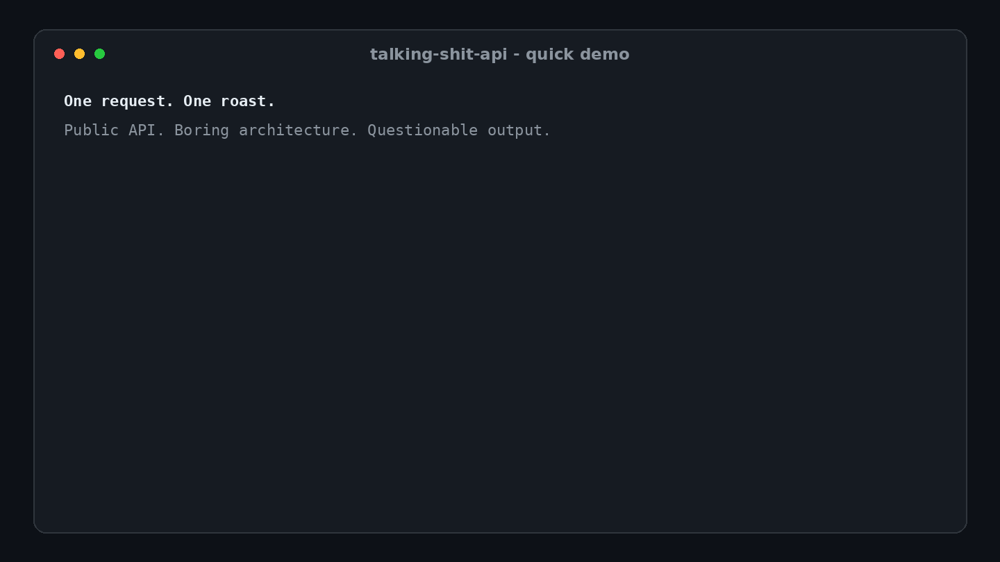

# Talking Shit API

<p align="center">
  <strong>Professional-grade shit talking for unprofessional developer moments.</strong>
</p>

<p align="center">
  <a href="https://github.com/codethor0/talking-shit-api/actions/workflows/ci.yml"></a>
  <a href="https://github.com/codethor0/talking-shit-api/releases"></a>
  <a href="SECURITY.md"></a>
  <a href="LICENSE"></a>
  
  
  
</p>

<p align="center">
  <a href="#try-it-in-10-seconds">Try it</a> |
  <a href="#api-at-a-glance">API</a> |
  <a href="#for-agents-and-automated-clients">Agents</a> |
  <a href="#study-how-an-api-call-works">Learn</a> |
  <a href="docs/README.md">Docs</a> |
  <a href="CONTRIBUTING.md">Contribute</a>
</p>

<p align="center">
  One Cloudflare Worker. Zero runtime dependencies. No database. No authentication. No application secrets. No outbound runtime calls.
</p>

<p align="center">
  
</p>

Talking Shit API is a tiny public API for curated developer roasts by category and intensity. Give it a category. Give it a level. Get roasted. That is the product.

Supported release: [`v0.6.2`](https://github.com/codethor0/talking-shit-api/releases/tag/v0.6.2)

Live API: `https://talking-shit-api.codethor0.workers.dev`

OpenAPI: `https://talking-shit-api.codethor0.workers.dev/openapi.json`


## Try it in 10 seconds

```bash
curl -s 'https://talking-shit-api.codethor0.workers.dev/v1/roast?category=code&level=dark' | jq
```

Example response:

```json
{
  "ok": true,
  "data": {
    "text": "This code is a digital crime scene and git blame is the autopsy report.",
    "category": "code",
    "level": "dark"
  },
  "meta": {
    "api_version": "v1",
    "service_version": "0.6.2"
  }
}
```

Want the API to make every decision:

```bash
curl -s 'https://talking-shit-api.codethor0.workers.dev/v1/surprise' | jq
```

Want randomness inside one category or intensity:

```bash
curl -s 'https://talking-shit-api.codethor0.workers.dev/v1/surprise?category=git&level=spicy' | jq
```

Need a few unique roasts at once:

```bash
curl -s 'https://talking-shit-api.codethor0.workers.dev/v1/batch?count=3&category=code&level=dark' | jq
```

## API at a glance

| Route | What it does |
| --- | --- |
| `GET /` | Service metadata and endpoint discovery |
| `GET /v1/health` | Health and service-version check |
| `GET /v1/categories` | Lists supported categories and intensity levels |
| `GET /v1/roast` | Returns one curated roast |
| `GET /v1/batch` | Returns one to five unique roasts |
| `GET /v1/surprise` | Randomizes any omitted category or level |
| `GET /v1/stats` | Returns catalog statistics |
| `GET /openapi.json` | OpenAPI contract |
| `HEAD` | Supported on the public GET routes |
| `OPTIONS` | Supported on the public GET routes |

Categories: `general`, `code`, `debugging`, `deploy`, `meetings`, `security`, `git`, `oncall`.

Levels: `mild`, `spicy`, `dark`.

Defaults are `general` and `spicy`. Batch count defaults to `3` and is capped at `5`. Surprise randomizes any omitted category or level.

Since v0.8.0, routes that take no parameters (`/`, `/v1/health`, `/v1/categories`, `/v1/stats`, `/openapi.json`) reject any query string with `400 INVALID_REQUEST` instead of silently ignoring it. An empty `?` is accepted, and `OPTIONS` preflights are unaffected.

## For agents and automated clients

The OpenAPI contract is written to be turned directly into tools. This section describes v0.8.0 and later; earlier releases publish a plainer contract without `operationId` values and return shorter error messages. Every `GET` operation has a stable `operationId` (`getRoast`, `getRoastBatch`, `getSurpriseRoast`, `listCategories`, `getCatalogStats`, `getHealth`, `getServiceIndex`, `getOpenApiDocument`), a description of when to use it, described parameters, and a JSON Schema for both success and error bodies.

Validation errors name the allowed values, so a client that guesses wrong can correct itself without a second lookup:

```json
{
  "ok": false,
  "error": {
    "code": "INVALID_REQUEST",
    "message": "Unknown category. Expected one of: general, code, debugging, deploy, meetings, security, git, oncall."
  },
  "meta": { "api_version": "v1", "service_version": "0.8.0" }
}
```

Error messages are built only from static allowlists and never echo rejected input.

To watch a model discover and call the API, see the local agent lab in `lab/README.md`.

## Study how an API call works

The service is small enough to follow one request end to end: client timing phases, the headers Cloudflare adds, the designed error paths, sampled server-side logs, and a Claude model calling the API as tools. Every step uses free tools and no extra Cloudflare resources. Start with `docs/LEARNING.md`.

## Intentionally boring underneath

The joke is the output. The architecture is deliberately not a joke.

- One stateless TypeScript Cloudflare Worker.
- Zero runtime dependencies.
- No database, cache, queue, AI model, authentication system, or user account state.
- No arbitrary user-submitted text.
- No application secrets.
- No outbound runtime network calls.
- Cryptographic random selection.
- Strict allowlisted input validation with duplicate-parameter rejection and bounded URL length.
- Native Cloudflare rate limiting keyed from a hashed client address.
- `Cache-Control: no-store`, wildcard credential-free CORS, and defensive response headers.
- Free-tier only: the policy check fails on any unreviewed `wrangler.jsonc` key, so a billable binding cannot merge by accident. See `docs/security/FREE_TIER.md`.
- Preview URLs disabled; native Workers Logs sampled at 25% and traces sampled at 1% for bounded production observability.
- No custom application logging or external telemetry export destinations; request query strings are redacted from platform logs and traces.
- Signed commits, protected `main`, read-only CI, CodeQL, dependency review, private vulnerability reporting, and scheduled supply-chain verification.

Documentation is indexed in `docs/README.md`. The architecture is documented in `docs/ARCHITECTURE.md`. The threat model is in `docs/THREAT_MODEL.md`. Operational security guidance is indexed in `docs/security/README.md`.

## Security researchers

If you are here to poke at it, good. Read `SECURITY.md` first.

Low-volume, non-destructive testing of the documented public API is in scope. Availability degradation, distributed rate-limit bypass, credential attacks, social engineering, and testing unrelated GitHub or Cloudflare infrastructure are not.

Security reports should use GitHub Private Vulnerability Reporting instead of public issues.

## Run it locally

Requirements: Node.js 24 and npm.

```bash
git clone https://github.com/codethor0/talking-shit-api.git
cd talking-shit-api
npm ci
npm run types
npm run verify
npm run dev
```

Then:

```bash
curl -s 'http://localhost:8787/v1/roast?category=debugging&level=spicy' | jq
```

The complete local release gate is:

```bash
npm run verify
```

It checks repository policy, linting, generated Cloudflare types, strict TypeScript, unit tests, workerd-boundary tests, shell syntax, a Wrangler dry-run build, dependency policy, and the vulnerability audit.

## Contributing

Read `CONTRIBUTING.md` before opening a pull request. If you use an AI coding agent, also read `AGENTS.md` and `docs/AGENT-WORKFLOW.md`.

For project support and feature requests, see `SUPPORT.md`.

For security issues, see `SECURITY.md`.

## Support development

If this dumb little API earned a place in your terminal, use the Sponsor button at the top of the repository to support continued open-source development.

GitHub Sponsors is configured through `.github/FUNDING.yml`. Sponsor payouts are handled through the maintainer's GitHub Sponsors and Stripe setup.

## Maintainer

Built and maintained by [@codethor0](https://github.com/codethor0).

Canonical product naming and brand usage are documented in `docs/BRAND.md`.

## Cost model

The service is designed to run for free on the Cloudflare Workers Free plan and a public GitHub repository. Cloudflare documents no overage billing on Free: an exhausted allowance makes operations fail instead of costing money. There is no paid database, API, AI model, email service, or custom domain requirement.

`docs/security/FREE_TIER.md` catalogs each Cloudflare resource, its free allowance, what it does at the limit, and the estimated worst-case observability usage of the current configuration, about 17.5 percent of the daily Free quota. The rule and its enforcement are in `docs/DOCTRINE.md` section 21 and ADR 0006.

The current `workers.dev` hostname is an intentional hobby-project tradeoff. Cloudflare recommends a custom domain or Worker route for business-critical production workloads. See `docs/security/CLOUDFLARE.md` for the deployment and abuse-risk boundary.

## License

MIT. See `LICENSE`.
